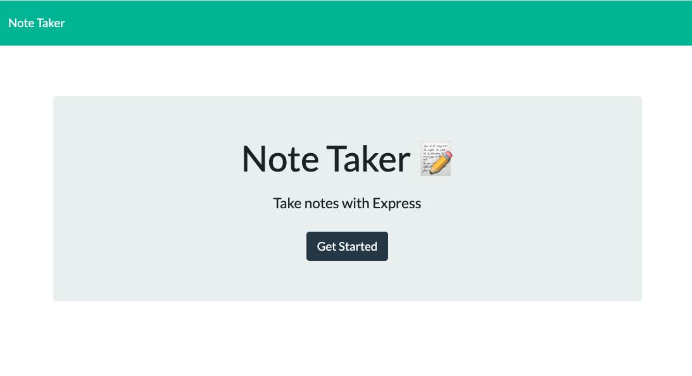

# Note-Taker

Table of content

- [Note-Taker](#note-taker)
- [Description](#description)
- [Building Structure](#building-structure)
- [Screenshots](#screenshots)
- [Tech/Framwork used](#techframwork-used)
- [Repositery content + link](#repositery-content--link)

# Description

This web application allow the user to add, save and delete "to do's" on a to do list. The application uses node and for example the express package to which allows to set up middlerwares to respond to HTTP requests. The landing page shows a "Get started" button, which guides the user to the second page where the notes (headline + text) can be added, saved and deleted.

# Building Structure

The application had given code (public, db folder and the package.json file). The server side file (server.js) has been added as well as the package-lock.json, the routes folder (api-routes.js + html-routes.js), the .gitgnore file and the node_modules. Starting with the server.js which includes the file system module require to get the respective node modules like express and to serve the static files. The routes files handle the GET, POST and DELETE requests.

# Screenshots

# Tech/Framwork used

- JavaScript
- Node.js
- npm packages: require, express
- html
- css
- bootstrap

# Repositery content + link

- db
  - db.json
- image
  - 1-Screenshot.png
  - 2-Screenshot.png
- node_modules
- public
  - assets
    - css
      - styles.css
  - js
    - index.js
  - index.html
  - notes.html
- routes
  - api-routes.js
  - html-routes.js
- .gitignore
- package-lock.json
- package.json
- README.md
- server.js

- GitHub (dev branch): https://github.com/JenBerlin/Note-Taker/tree/dev
- Heroku: https://note-taker-bla-bla.herokuapp.com/
